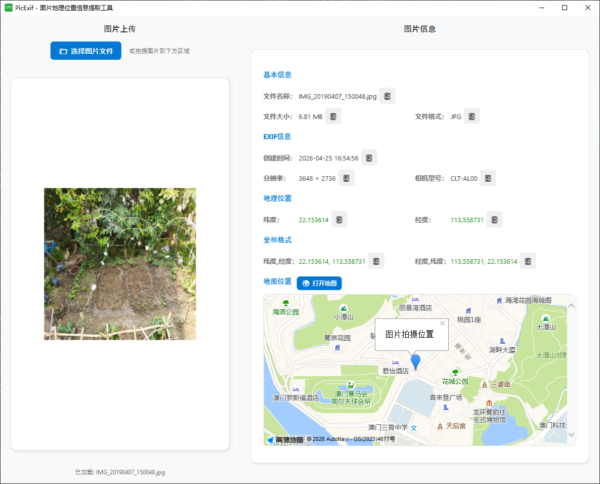

# PicExif - Image EXIF & GPS Information Extractor

## Overview

PicExif is a Windows desktop application that extracts and displays GPS location information and other metadata from images.

### Screenshot



### Features

1. **Image Upload**:
   - Drag and drop images onto the upload area
   - Click the button to select image files

2. **Image Preview**:
   - Automatically displays image thumbnail after upload

3. **Information Display**:
   - **Basic Info**: File name, file size, file format
   - **EXIF Info**: Creation time, resolution, camera model
   - **GPS Location**: Latitude, longitude, two coordinate formats (lat,lng and lng,lat)
   - **Map Display**: Built-in AMap (高德地图) showing photo location

4. **Copy Function**:
   - Each information field has a copy button
   - Click to copy the corresponding information to clipboard

## System Requirements

- Windows 10 or higher
- .NET 6.0 Runtime

## Quick Start

### ⭐ No Compilation Needed! Use Directly

If you don't want to compile from source, you can download the pre-built ZIP package from the project's Releases page, extract it, and double-click `PicExif.exe` to use it!

### 1. Configure API Key (Optional)

The project uses AMap API to display maps. Before first use:

1. Copy `appsettings.json.example` to `appsettings.json`
2. Edit `appsettings.json` and fill in your AMap API key
3. If not configured, the default key will be used

### 2. Build and Run

```bash
dotnet build
dotnet run
```

Or run the compiled executable at `bin\Debug\net6.0-windows\PicExif.exe`

### Usage

1. Drag an image onto the upload area or click "Select Image File"
2. View the image information displayed on the right
3. Click the copy button next to any information field
4. Click "Open Map" to view the detailed location in browser

## Technical Details

- Framework: WPF (.NET 6.0)
- Image Metadata Extraction: MetadataExtractor library
- Image Processing: System.Drawing.Common
- Configuration: Microsoft.Extensions.Configuration
- Map Service: AMap API
- UI Design: Modern WPF interface

## Project Structure

```
PicExif/
├── Models/                  # Data models
│   └── ImageInfo.cs         # Image information model
├── Services/                # Services
│   ├── ExifService.cs       # EXIF data extraction service
│   └── ImageService.cs      # Image processing service
├── Resources/               # Resource files
│   ├── app_icon.ico
│   ├── favicon.ico
│   └── favicon-16x16.png
├── App.xaml                 # Application entry
├── App.xaml.cs
├── MainWindow.xaml          # Main window UI
├── MainWindow.xaml.cs       # Main window logic
├── appsettings.json.example # Configuration example
├── PicExif.csproj           # Project configuration
└── README.md
```

## Development Guide

### Build from Source

1. Clone or download the project
2. Copy `appsettings.json.example` to `appsettings.json` and configure (optional)
3. Run `dotnet restore` to restore dependencies
4. Run `dotnet build` to build the project
5. Run `dotnet run` to start the application

### Publish Application

```bash
dotnet publish -c Release -r win-x64 --self-contained true
```

## Notes

- Only supports common image formats (JPG, PNG, BMP, TIFF, GIF, etc.)
- GPS location information is only displayed when the image contains GPS data
- First run may take some time to load dependencies
- Please keep your API keys safe and do not commit them to public repositories

## Version Info

- Version: 1.0.0
- Release Date: 2026-04-27
